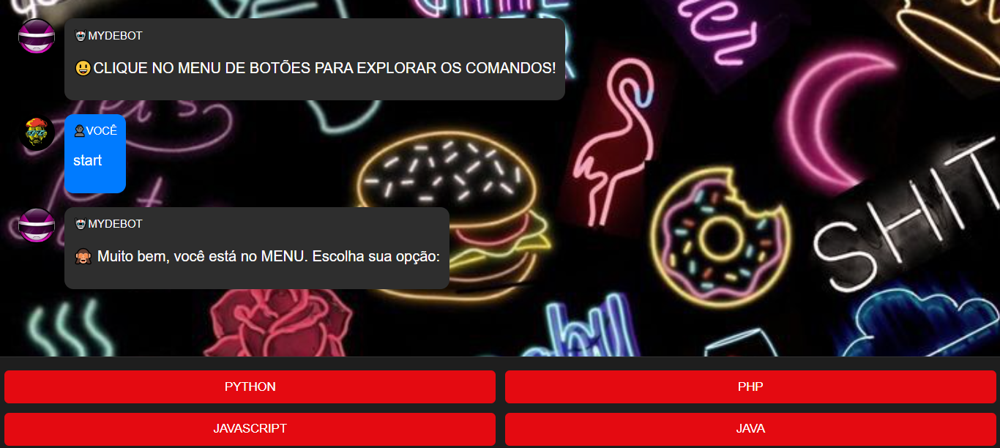
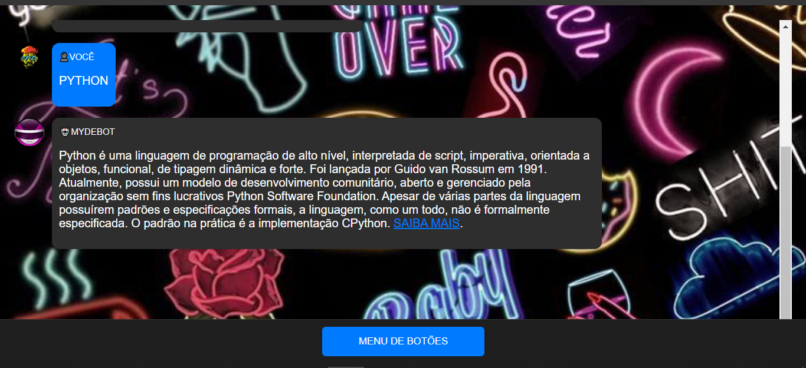

# MYDEBOT
👨‍🏫ELE RESPONDE A MENSAGENS DE TEXTO DO USUÁRIO E PODE EXIBIR BOTÕES INTERATIVOS QUE PERMITEM AO USUÁRIO SELECIONAR DIFERENTES OPÇÕES.

  
  

## DESCRIÇÃO:
Este app é um chatbot interativo chamado **MYDEBOT** que permite que os usuários explorem comandos relacionados a diferentes linguagens de programação, como Python, PHP, JavaScript e Java. O bot responde com descrições detalhadas dessas linguagens e fornece links para aprender mais. O aplicativo simula uma conversa entre o usuário e o bot, exibindo mensagens em formato de chat com avatares para ambos os lados.

## EXECUTANDO O PROJETO:
1. **Iniciar o Bot**:
   - Abra o arquivo `./CODIGO/index.html` no navegador de sua preferencia.
   - Quando a página é carregada, o MYDEBOT irá exibir uma mensagem inicial: "CLIQUE NO MENU DE BOTÕES PARA EXPLORAR OS COMANDOS!".
   - O usuário deve clicar no botão "MENU DE BOTÕES" localizado na parte inferior da tela.

2. **Interação com os Botões**:
   - Ao clicar no botão "MENU DE BOTÕES", aparecerá uma lista de opções de linguagens de programação, como "PYTHON", "PHP", "JAVASCRIPT" e "JAVA".
   - Cada botão representa uma linguagem, e ao clicar em uma delas, o usuário verá uma mensagem do MYDEBOT contendo uma descrição sobre a linguagem escolhida.

3. **Receber Respostas**:
   - O chatbot responde automaticamente com informações sobre a linguagem selecionada, e a descrição inclui um link "SAIBA MAIS" que direciona o usuário para a página correspondente na Wikipedia.

4. **Fluxo do Chat**:
   - A interação entre o usuário e o bot ocorre em uma interface de chat. As mensagens do usuário aparecem com o avatar "VOCÊ", enquanto as respostas do MYDEBOT aparecem com o avatar de um robô.
   - O chat simula uma troca de mensagens dinâmica, com respostas que aparecem após um breve intervalo.

## NÃO SABE?
- Entendemos que para manipular arquivos em `HTML`, `CSS` e outras linguagens relacionadas, é necessário possuir conhecimento nessas áreas. Para auxiliar nesse aprendizado, oferecemos cursos gratuitos disponíveis:
* [CURSO DE HTML E CSS](https://github.com/VILHALVA/CURSO-DE-HTML-E-CSS)
* [CURSO DE JAVASCRIPT](https://github.com/VILHALVA/CURSO-DE-JAVASCRIPT)
* [CURSO DE JQUERY](https://github.com/VILHALVA/CURSO-DE-JQUERY)
* [CONFIRA MAIS CURSOS](https://github.com/VILHALVA?tab=repositories&q=+topic:CURSO)

## CREDITOS:
- [PROJETO CRIADO PELO VILHALVA](https://github.com/VILHALVA)